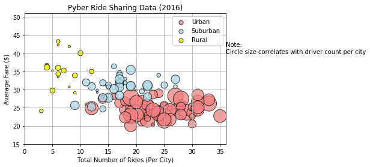
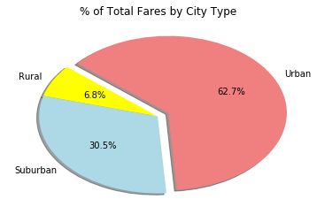
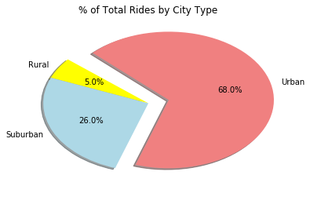
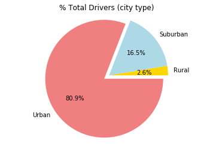

Oberserved analysis
1. Looking at the scatterplot chart, you can see that urban cities have about eighty percent more drivers than rural cities.This is indicates that competition is high in urban cities, thus concluding that fare prices in urban cities are more than half the price of those in rural cities; indicating that urban cities have a higher population than suburban and rural cities. 

2. According to the pie charts, the percent of total fare by city, percent of total drivers by city, and the percent of total rides by city is higher than rural and suburban cities by over half. Therefore, indicating that the demand for uber drivers in urban cities is higher. One can quickly conclude that people would not rather drive themselves in a city environment.

3. According to all three charts, rural cities use very little to none uber services. Knowing rural cities and it's geography, one can conclude that majority of it's population owns a car. 


```python
%matplotlib notebook
```


```python
# Import Dependencies
import pandas as pd
import numpy as np
import matplotlib.pyplot as plt
import seaborn as sns
```


```python
# path to csv files
pycity_file = "raw_data/city_data.csv"
pyride_file = "raw_data/ride_data.csv"
```


```python
# reading the files and creating dataframe
pycity_df = pd.read_csv(pycity_file)
pyride_df = pd.read_csv(pyride_file)

# delete any duplicate cities
# pycity_df = pycity_df.drop_duplicates('city')
# cities = pycity_df['city']
#testing
# cities

#merging the dataframes

merged_df = pycity_df.merge(pyride_df)
merged_df
```


<div>
<style scoped>
    .dataframe tbody tr th:only-of-type {
        vertical-align: middle;
    }

    .dataframe tbody tr th {
        vertical-align: top;
    }

    .dataframe thead th {
        text-align: right;
    }
</style>
<table border="1" class="dataframe">
  <thead>
    <tr style="text-align: right;">
      <th></th>
      <th>city</th>
      <th>driver_count</th>
      <th>type</th>
      <th>date</th>
      <th>fare</th>
      <th>ride_id</th>
    </tr>
  </thead>
  <tbody>
    <tr>
      <th>0</th>
      <td>Richardfort</td>
      <td>38</td>
      <td>Urban</td>
      <td>2018-02-24 08:40:38</td>
      <td>13.93</td>
      <td>5628545007794</td>
    </tr>
    <tr>
      <th>1</th>
      <td>Richardfort</td>
      <td>38</td>
      <td>Urban</td>
      <td>2018-02-13 12:46:07</td>
      <td>14.00</td>
      <td>910050116494</td>
    </tr>
    <tr>
      <th>2</th>
      <td>Richardfort</td>
      <td>38</td>
      <td>Urban</td>
      <td>2018-02-16 13:52:19</td>
      <td>17.92</td>
      <td>820639054416</td>
    </tr>
    <tr>
      <th>3</th>
      <td>Richardfort</td>
      <td>38</td>
      <td>Urban</td>
      <td>2018-02-01 20:18:28</td>
      <td>10.26</td>
      <td>9554935945413</td>
    </tr>
    <tr>
      <th>4</th>
      <td>Richardfort</td>
      <td>38</td>
      <td>Urban</td>
      <td>2018-04-17 02:26:37</td>
      <td>23.00</td>
      <td>720020655850</td>
    </tr>
    <tr>
      <th>5</th>
      <td>Richardfort</td>
      <td>38</td>
      <td>Urban</td>
      <td>2018-04-21 03:44:04</td>
      <td>9.54</td>
      <td>3698147103219</td>
    </tr>
    <tr>
      <th>6</th>
      <td>Richardfort</td>
      <td>38</td>
      <td>Urban</td>
      <td>2018-02-03 00:14:26</td>
      <td>29.04</td>
      <td>4982665519010</td>
    </tr>
    <tr>
      <th>7</th>
      <td>Richardfort</td>
      <td>38</td>
      <td>Urban</td>
      <td>2018-02-08 15:50:12</td>
      <td>16.55</td>
      <td>2270463070874</td>
    </tr>
    <tr>
      <th>8</th>
      <td>Richardfort</td>
      <td>38</td>
      <td>Urban</td>
      <td>2018-04-03 15:07:34</td>
      <td>40.77</td>
      <td>9496210735824</td>
    </tr>
    <tr>
      <th>9</th>
      <td>Richardfort</td>
      <td>38</td>
      <td>Urban</td>
      <td>2018-02-19 14:09:20</td>
      <td>27.11</td>
      <td>8690324801449</td>
    </tr>
    <tr>
      <th>10</th>
      <td>Richardfort</td>
      <td>38</td>
      <td>Urban</td>
      <td>2018-04-22 03:06:56</td>
      <td>39.74</td>
      <td>4081388893008</td>
    </tr>
    <tr>
      <th>11</th>
      <td>Richardfort</td>
      <td>38</td>
      <td>Urban</td>
      <td>2018-01-31 14:51:01</td>
      <td>43.92</td>
      <td>4066949857460</td>
    </tr>
    <tr>
      <th>12</th>
      <td>Richardfort</td>
      <td>38</td>
      <td>Urban</td>
      <td>2018-03-04 22:13:57</td>
      <td>14.83</td>
      <td>9474112834050</td>
    </tr>
    <tr>
      <th>13</th>
      <td>Richardfort</td>
      <td>38</td>
      <td>Urban</td>
      <td>2018-03-28 19:33:00</td>
      <td>7.75</td>
      <td>5539056178883</td>
    </tr>
    <tr>
      <th>14</th>
      <td>Richardfort</td>
      <td>38</td>
      <td>Urban</td>
      <td>2018-02-14 03:27:28</td>
      <td>44.11</td>
      <td>2503858662225</td>
    </tr>
    <tr>
      <th>15</th>
      <td>Richardfort</td>
      <td>38</td>
      <td>Urban</td>
      <td>2018-04-27 11:59:25</td>
      <td>30.31</td>
      <td>6106446829435</td>
    </tr>
    <tr>
      <th>16</th>
      <td>Richardfort</td>
      <td>38</td>
      <td>Urban</td>
      <td>2018-03-03 11:57:24</td>
      <td>11.42</td>
      <td>2916078036620</td>
    </tr>
    <tr>
      <th>17</th>
      <td>Richardfort</td>
      <td>38</td>
      <td>Urban</td>
      <td>2018-01-13 10:08:54</td>
      <td>25.81</td>
      <td>9110913538598</td>
    </tr>
    <tr>
      <th>18</th>
      <td>Richardfort</td>
      <td>38</td>
      <td>Urban</td>
      <td>2018-03-06 12:53:05</td>
      <td>8.28</td>
      <td>5127600643309</td>
    </tr>
    <tr>
      <th>19</th>
      <td>Richardfort</td>
      <td>38</td>
      <td>Urban</td>
      <td>2018-02-05 16:12:04</td>
      <td>42.22</td>
      <td>4051093040264</td>
    </tr>
    <tr>
      <th>20</th>
      <td>Richardfort</td>
      <td>38</td>
      <td>Urban</td>
      <td>2018-04-04 15:04:56</td>
      <td>16.35</td>
      <td>6077906760851</td>
    </tr>
    <tr>
      <th>21</th>
      <td>Richardfort</td>
      <td>38</td>
      <td>Urban</td>
      <td>2018-03-05 16:00:59</td>
      <td>4.85</td>
      <td>3291539624738</td>
    </tr>
    <tr>
      <th>22</th>
      <td>Richardfort</td>
      <td>38</td>
      <td>Urban</td>
      <td>2018-04-14 11:56:28</td>
      <td>43.01</td>
      <td>7636011510547</td>
    </tr>
    <tr>
      <th>23</th>
      <td>Richardfort</td>
      <td>38</td>
      <td>Urban</td>
      <td>2018-01-21 23:20:53</td>
      <td>10.91</td>
      <td>3567611375530</td>
    </tr>
    <tr>
      <th>24</th>
      <td>Richardfort</td>
      <td>38</td>
      <td>Urban</td>
      <td>2018-03-16 23:00:51</td>
      <td>21.39</td>
      <td>237473464569</td>
    </tr>
    <tr>
      <th>25</th>
      <td>Richardfort</td>
      <td>38</td>
      <td>Urban</td>
      <td>2018-03-22 04:41:04</td>
      <td>16.35</td>
      <td>5934239154720</td>
    </tr>
    <tr>
      <th>26</th>
      <td>Richardfort</td>
      <td>38</td>
      <td>Urban</td>
      <td>2018-01-03 01:06:17</td>
      <td>5.32</td>
      <td>3268844473610</td>
    </tr>
    <tr>
      <th>27</th>
      <td>Richardfort</td>
      <td>38</td>
      <td>Urban</td>
      <td>2018-03-29 15:16:01</td>
      <td>37.76</td>
      <td>4802688422688</td>
    </tr>
    <tr>
      <th>28</th>
      <td>Williamsstad</td>
      <td>59</td>
      <td>Urban</td>
      <td>2018-01-23 17:51:24</td>
      <td>19.62</td>
      <td>125986195523</td>
    </tr>
    <tr>
      <th>29</th>
      <td>Williamsstad</td>
      <td>59</td>
      <td>Urban</td>
      <td>2018-03-29 21:43:04</td>
      <td>35.58</td>
      <td>4747780858464</td>
    </tr>
    <tr>
      <th>...</th>
      <td>...</td>
      <td>...</td>
      <td>...</td>
      <td>...</td>
      <td>...</td>
      <td>...</td>
    </tr>
    <tr>
      <th>2345</th>
      <td>Bradshawfurt</td>
      <td>7</td>
      <td>Rural</td>
      <td>2018-03-24 18:53:18</td>
      <td>57.51</td>
      <td>2301998876294</td>
    </tr>
    <tr>
      <th>2346</th>
      <td>Bradshawfurt</td>
      <td>7</td>
      <td>Rural</td>
      <td>2018-03-24 07:34:03</td>
      <td>19.89</td>
      <td>7867402022145</td>
    </tr>
    <tr>
      <th>2347</th>
      <td>Bradshawfurt</td>
      <td>7</td>
      <td>Rural</td>
      <td>2018-02-18 22:21:26</td>
      <td>34.32</td>
      <td>8881996813087</td>
    </tr>
    <tr>
      <th>2348</th>
      <td>Bradshawfurt</td>
      <td>7</td>
      <td>Rural</td>
      <td>2018-04-08 13:46:03</td>
      <td>55.19</td>
      <td>1742954306812</td>
    </tr>
    <tr>
      <th>2349</th>
      <td>Bradshawfurt</td>
      <td>7</td>
      <td>Rural</td>
      <td>2018-04-07 21:12:49</td>
      <td>49.70</td>
      <td>5088814323688</td>
    </tr>
    <tr>
      <th>2350</th>
      <td>Bradshawfurt</td>
      <td>7</td>
      <td>Rural</td>
      <td>2018-02-23 12:00:59</td>
      <td>37.05</td>
      <td>2068423024643</td>
    </tr>
    <tr>
      <th>2351</th>
      <td>Bradshawfurt</td>
      <td>7</td>
      <td>Rural</td>
      <td>2018-04-10 09:47:54</td>
      <td>19.07</td>
      <td>739305106253</td>
    </tr>
    <tr>
      <th>2352</th>
      <td>Bradshawfurt</td>
      <td>7</td>
      <td>Rural</td>
      <td>2018-01-19 20:21:54</td>
      <td>56.78</td>
      <td>1253403506597</td>
    </tr>
    <tr>
      <th>2353</th>
      <td>Bradshawfurt</td>
      <td>7</td>
      <td>Rural</td>
      <td>2018-01-30 10:55:23</td>
      <td>51.39</td>
      <td>1328274868072</td>
    </tr>
    <tr>
      <th>2354</th>
      <td>New Ryantown</td>
      <td>2</td>
      <td>Rural</td>
      <td>2018-01-27 17:33:41</td>
      <td>42.68</td>
      <td>7994603753131</td>
    </tr>
    <tr>
      <th>2355</th>
      <td>New Ryantown</td>
      <td>2</td>
      <td>Rural</td>
      <td>2018-04-18 19:43:54</td>
      <td>42.97</td>
      <td>230914178346</td>
    </tr>
    <tr>
      <th>2356</th>
      <td>New Ryantown</td>
      <td>2</td>
      <td>Rural</td>
      <td>2018-02-04 23:54:51</td>
      <td>45.70</td>
      <td>3570428225530</td>
    </tr>
    <tr>
      <th>2357</th>
      <td>New Ryantown</td>
      <td>2</td>
      <td>Rural</td>
      <td>2018-04-30 01:50:44</td>
      <td>50.81</td>
      <td>5357550405010</td>
    </tr>
    <tr>
      <th>2358</th>
      <td>New Ryantown</td>
      <td>2</td>
      <td>Rural</td>
      <td>2018-04-05 21:38:18</td>
      <td>50.98</td>
      <td>4834855490008</td>
    </tr>
    <tr>
      <th>2359</th>
      <td>New Ryantown</td>
      <td>2</td>
      <td>Rural</td>
      <td>2018-05-05 19:29:38</td>
      <td>26.53</td>
      <td>2302209966018</td>
    </tr>
    <tr>
      <th>2360</th>
      <td>Randallchester</td>
      <td>9</td>
      <td>Rural</td>
      <td>2018-04-13 11:13:31</td>
      <td>43.22</td>
      <td>1076079536213</td>
    </tr>
    <tr>
      <th>2361</th>
      <td>Randallchester</td>
      <td>9</td>
      <td>Rural</td>
      <td>2018-02-19 03:52:47</td>
      <td>58.55</td>
      <td>8004803682564</td>
    </tr>
    <tr>
      <th>2362</th>
      <td>Randallchester</td>
      <td>9</td>
      <td>Rural</td>
      <td>2018-02-11 05:42:29</td>
      <td>25.78</td>
      <td>9010611749008</td>
    </tr>
    <tr>
      <th>2363</th>
      <td>Randallchester</td>
      <td>9</td>
      <td>Rural</td>
      <td>2018-03-25 13:36:46</td>
      <td>10.37</td>
      <td>3216382725494</td>
    </tr>
    <tr>
      <th>2364</th>
      <td>Randallchester</td>
      <td>9</td>
      <td>Rural</td>
      <td>2018-04-07 23:42:07</td>
      <td>10.79</td>
      <td>1615474447641</td>
    </tr>
    <tr>
      <th>2365</th>
      <td>Jessicaport</td>
      <td>1</td>
      <td>Rural</td>
      <td>2018-01-01 09:45:36</td>
      <td>43.69</td>
      <td>2424875833354</td>
    </tr>
    <tr>
      <th>2366</th>
      <td>Jessicaport</td>
      <td>1</td>
      <td>Rural</td>
      <td>2018-01-14 07:09:17</td>
      <td>18.05</td>
      <td>5405362355006</td>
    </tr>
    <tr>
      <th>2367</th>
      <td>Jessicaport</td>
      <td>1</td>
      <td>Rural</td>
      <td>2018-04-13 16:08:11</td>
      <td>39.89</td>
      <td>6511242590852</td>
    </tr>
    <tr>
      <th>2368</th>
      <td>Jessicaport</td>
      <td>1</td>
      <td>Rural</td>
      <td>2018-03-18 16:59:40</td>
      <td>33.72</td>
      <td>3046889917159</td>
    </tr>
    <tr>
      <th>2369</th>
      <td>Jessicaport</td>
      <td>1</td>
      <td>Rural</td>
      <td>2018-05-01 08:14:47</td>
      <td>22.44</td>
      <td>3725278487786</td>
    </tr>
    <tr>
      <th>2370</th>
      <td>Jessicaport</td>
      <td>1</td>
      <td>Rural</td>
      <td>2018-01-31 17:57:25</td>
      <td>58.29</td>
      <td>623154556195</td>
    </tr>
    <tr>
      <th>2371</th>
      <td>South Saramouth</td>
      <td>7</td>
      <td>Rural</td>
      <td>2018-02-20 16:32:36</td>
      <td>44.29</td>
      <td>3622365199969</td>
    </tr>
    <tr>
      <th>2372</th>
      <td>South Saramouth</td>
      <td>7</td>
      <td>Rural</td>
      <td>2018-01-28 15:55:33</td>
      <td>31.25</td>
      <td>7118046558393</td>
    </tr>
    <tr>
      <th>2373</th>
      <td>South Saramouth</td>
      <td>7</td>
      <td>Rural</td>
      <td>2018-03-27 21:07:16</td>
      <td>11.87</td>
      <td>170351888128</td>
    </tr>
    <tr>
      <th>2374</th>
      <td>South Saramouth</td>
      <td>7</td>
      <td>Rural</td>
      <td>2018-04-12 18:11:50</td>
      <td>57.23</td>
      <td>5081198789583</td>
    </tr>
  </tbody>
</table>
<p>2375 rows × 6 columns</p>
</div>


# Bubble plot per city


```python
# creating DataFrame for each city
#Urban (total revenue, total number of rides, average fare, total number of drivers)
urban = merged_df.loc[merged_df['type'] == 'Urban']
urban_total_revenue = urban.groupby('city').sum()['fare']
urban_total_number_of_rides = urban.groupby('city').count()['ride_id']
urban_average_fare = round(urban_total_revenue/urban_total_number_of_rides,2)
urban_total_drivers =urban.drop_duplicates('city').set_index('city')['driver_count']

#suburban (total revenue, total number of rides, average fare, total number of drivers)
suburban = merged_df.loc[merged_df['type'] == 'Suburban']
suburban_total_revenue = suburban.groupby('city').sum()['fare']
suburban_total_number_of_rides = suburban.groupby('city').count()['ride_id']
suburban_average_fare = round(suburban_total_revenue/suburban_total_number_of_rides,2)
suburban_total_drivers = suburban.drop_duplicates('city').set_index('city')['driver_count']

#rural(total revenue, total number of rides, average fare, total number of drivers)
rural = merged_df.loc[merged_df['type'] == 'Rural']
rural_total_revenue = rural.groupby('city').sum()['fare']
rural_total_number_of_rides = rural.groupby('city').count()['ride_id']
rural_average_fare = round(rural_total_revenue/rural_total_number_of_rides, 2)
rural_total_drivers = rural.drop_duplicates('city').set_index('city')['driver_count']

#creating the the plot for urban,suburban and rural cities
#urban
plt.scatter(urban_total_number_of_rides, urban_average_fare, marker='o', 
            facecolors='lightcoral', edgecolors='black', 
            s=urban_total_drivers*10, alpha=0.75, label='Urban')
#suburban
plt.scatter(suburban_total_number_of_rides, suburban_average_fare, marker='o', 
            facecolors='lightblue', edgecolors='black', 
            s=suburban_total_drivers*10, alpha=0.75, label='Suburban')
#rural
plt.scatter(rural_total_number_of_rides, rural_average_fare, marker='o', 
            facecolors='yellow', edgecolors='black', 
            s=rural_total_drivers*10, alpha=0.75, label='Rural')
#labels
plt.title("Pyber Ride Sharing Data (2016)")
plt.xlabel("Total Number of Rides (Per City)")
plt.xlim(0,36)
plt.ylabel("Average Fare ($)")
plt.ylim(15,51)
lgnd = plt.legend(scatterpoints=1)
lgnd.legendHandles[0]._sizes = [50]
lgnd.legendHandles[1]._sizes = [50]
lgnd.legendHandles[2]._sizes = [50]

plt.annotate(s='Note:\nCircle size correlates with driver count per city', xy=(0,15), xytext=(36,40))
plt.grid()
plt.show()
```





```python
#Total Revenue for all cities
fare_total = merged_df['fare'].sum()

#total fares by type of city
fare_type = merged_df.groupby('type').sum()['fare']

#percent of revenye by city type
fare_percent = (fare_type/fare_total) 

#labels
labels = fare_percent.index

#size of slice, colors, explode
sizes = fare_percent
colors = ['yellow', 'lightblue', 'lightcoral']
explode = (0, 0, 0.1)

#pie chart
plt.pie(sizes, explode=explode, labels=labels, colors=colors,
        autopct="%1.1f%%", shadow=True, startangle=140)
plt.title("% of Total Fares by City Type")
plt.show()

```





# Total Rides by City Type


```python
# Number of rides by the city type
ride_type = merged_df.groupby('type').count()['ride_id']
# total number of rides
total_rides = merged_df['fare'].count()
#percent of rides
ride_percent = round((ride_type/total_rides),2)
#labels,sizes, colors, explode
labels = ride_percent.index
sizes = ride_percent
explode = (0,0,0.2)
colors = ['yellow', 'lightblue', 'lightcoral']

plt.pie(sizes, explode=explode, labels=labels, colors=colors,
        autopct="%1.1f%%", shadow=True, startangle=140)
plt.title("% of Total Rides by City Type")

plt.show()
```





# Total Drivers by City Type


```python
#drivers by city type
city_ride_dup = merged_df.drop_duplicates(['city', 'driver_count'], keep = 'first')
#total number of drivers
total_drivers = city_ride_dup.groupby('type')['driver_count'].sum()
plt.pie(total_drivers,explode=(0,0,0.1),colors = ["gold", "lightblue", "lightcoral"],
        autopct="%1.1f%%", labels=["Rural","Suburban","Urban"])
plt.axis("equal")
plt.title("% Total Drivers (city type)")
plt.show() 

```




